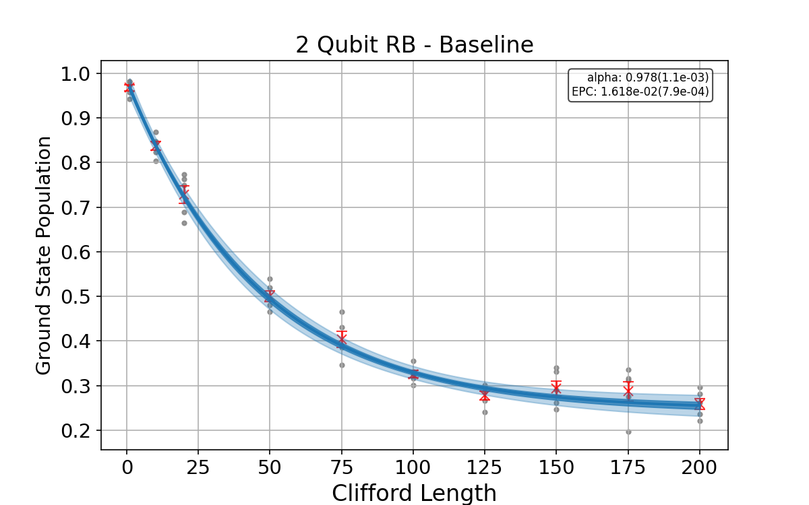

# Updated Randomized Benchmarking (RB) with Qiskit Experiments

This project provides an updated implementation of Randomized Benchmarking (RB) using the modern `qiskit-experiments` library, originally inspired by the Qiskit Textbook's `qiskit.ignis` based tutorial ([QISKIT TUTORIAL](https://github.com/Qiskit/textbook/blob/main/notebooks/quantum-hardware/randomized-benchmarking.ipynb)).

## Project Content

The Python script (`main.py`) performs 2-qubit Randomized Benchmarking on a simulated `AerSimulator` backend. It allows for:
*   Defining a custom depolarizing noise model with configurable error rates for single-qubit ($p_{1Q}$) and two-qubit ($p_{2Q}$) gates (`u2`, `u3`, `cx`).
*   Running RB experiments with varying parameters:
    *   Noise levels ($p_{1Q}$, $p_{2Q}$).
    *   Clifford sequence lengths.
*   Extracting key metrics: Error Per Clifford (EPC) and the decay parameter $\alpha$.
*   Generating and saving customized plots of the RB decay curves for each experimental configuration.

The primary purpose is to demonstrate RB and explore the sensitivity of its results to changes in gate noise and experimental sampling parameters.

## Baseline Randomized Benchmarking Result

The following plot shows the typical RB decay curve for the baseline noise parameters ($p_{1Q}=0.002, p_{2Q}=0.01$).

## Key Observations from Parameter Variations

*   **Increased Gate Errors ($p_{1Q}$ or $p_{2Q}$):** Consistently leads to a higher (worse) EPC and a steeper decay (lower $\alpha$). The effect is generally more pronounced for two-qubit gate errors.
*   **Decreased Gate Errors:** Improves the EPC (lower value) and results in a shallower decay curve (higher $\alpha$).
*   **Clifford Length Selection:**
    *   Using only short or very few sequence lengths increases the statistical uncertainty in the fitted EPC and $\alpha$ values.
    *   A well-distributed set of lengths across the decay provides more precise and reliable estimations of these parameters.

## Conclusion

This updated RB implementation effectively characterizes simulated gate fidelities. The experiments highlight RB's sensitivity to both the underlying noise in quantum operations and the design of the benchmarking protocol itself (e.g., choice of Clifford lengths), underscoring its utility in quantum device/simulation assessment.